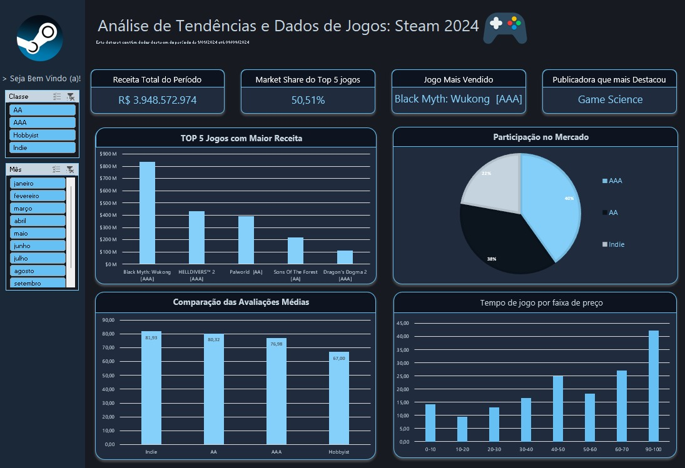

# 🎮 Steam 2024: Análise de Tendências e Performance de Mercado

Este projeto apresenta um Dashboard interativo desenvolvido no Microsoft Excel, focado na análise de dados reais do mercado de games na Steam durante o ano de 2024. O objetivo é transformar dados brutos em insights estratégicos sobre faturamento, qualidade e comportamento do consumidor.

---

## 📊 O Dataset

Os dados abragem o faturamento e o engajamento de usuários na plataforma Steam de jogos lançados entre janeiro e setembro de 2024. As principais variáveis trabalhadas foram:

* **Financeiro:** Receita gerada (Revenue) e faixas de preço de venda.
* **Qualidade:** *Review Scores* (média de avaliação dos usuários).
* **Segmentação:** Classificação de títulos por porte de produção (**AAA, AA, Indie e Hobbyist**).
* **Temporal:** Distribuição mensal de vendas.

---

## 🎯 Perguntas de Negócio

Para guiar a construção do dashboard, foram pensadas as seguintes perguntas:

1. **Concentração de Receita:** Como o faturamento total (R$ 3.9 Bi) está distribuído entre os milhares de títulos?
2. **Qualidade percebida:** Publicadoras indie conseguem competir em qualidade com o segmento AAA mesmo com as disparidades monetárias? 
3. **Comportamento de Preço:** Qual faixa de preço retém mais o jogador e gera maior volume financeiro?
4. **Dominância de Mercado:** Quais publicadoras e jogos lideram o Market Share do ano? 

---

## 💡 Principais Insights 

* **Alta Concentração (Lei de Pareto):** O mercado é extremamente polarizado. Apenas os **5 jogos mais vendidos detêm 50,51% de toda a receita** do período, demonstrando que o sucesso na plataforma é movido por grandes fenômenos de vendas. Assim, mensalmente temos alguns jogos que dominam completamente sobre todos os outros, com um desempenho de vendas muito maior, em geral relacionados aqueles relacionados com publicadoras AA ou AAA.
* **Qualidade vs. Orçamento:** Um dos maiores insights revelados é que os jogos **Indie e AA possuem avaliações médias superiores (81,93 e 80,32)** aos títulos AAA (76,98). Isso indica que, embora o investimento massivo garanta receita, a satisfação genuína do público está mais presente em estúdios menores. 
* **Elasticidade de Preço:** A faixa de preço de **R$ 90-100** é a que apresenta maior faturamento e tempo de jogo, provando que o consumidor Steam está disposto a pagar valores *premium* por experiências de alta fidelidade.
* **O Fenômeno do Ano:** A publicadora **Game Science** destaca-se como líder absoluta de 2024 devido ao lançamento de *Black Myth: Wukong*, que sozinho redefiniu os benchmarks de faturamento do terceiro trimestre.

---

## 🛠️ Tecnologias e Técnicas Aplicadas

* **Power Query (ETL):** Limpeza e tratamento de dados complexos. Utilização de **Linguagem M** (`Table.ReplaceValue`) para corrigir dados faltantes de avaliações e garantir a integridade da média ponderada.
* **Dax & Fórmulas Avançadas:** Uso de `INFODADOSTABELADINÂMICA`, `CARACT(10)` para rótulos de dados em múltiplas linhas e funções de concatenação lógica.
* **Design UI/UX:** Aplicação de paleta de cores personalizada, ícones e containers com bordas arredondadas para um visual de software profissional.
* **Interatividade:** Implementação de Slicers (Segmentadores de Dados) sincronizados entre múltiplas Tabelas Dinâmicas para análise por Classe e por Mês.

---

## 🚀 Como Visualizar

1. Faça o download do arquivo `.xlsx` disponível no repositório.
2. Certifique-se de habilitar as conexões de dados ao abrir o arquivo.
3. Utilize os filtros laterais para interagir com os gráficos e explorar os diferentes meses do ano.

